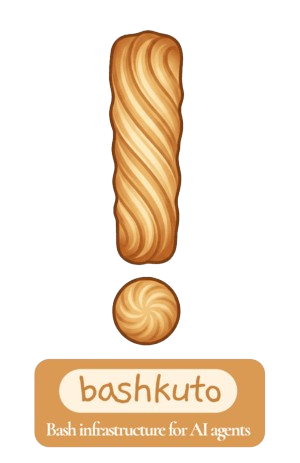

<div align="center">

# bashkuto



</div>

Bashkuto is a lightweight Python library that transforms Bash environments into agent-friendly runtimes. It provides AI agents with safe, structured, and efficient command execution capabilities with built-in safeguards for production use.

[](https://www.python.org/downloads/)
[](https://opensource.org/licenses/MIT)
[](https://pypi.org/project/BashkutoPackage/)
[](https://github.com/KadriSof/BashkutoPackage)
[](https://github.com/KadriSof/BashkutoPackage/issues)
[](https://github.com/KadriSof/BashkutoPackage/network)
[](https://github.com/KadriSof/BashkutoPackage/actions)
[](https://github.com/psf/black)
[](https://bashkuto.readthedocs.io/en/latest/?badge=latest)


---

## Features

- **Command Execution**: Safe subprocess execution with timing and error tracking
- **Pipe Chains**: Full support for complex Bash pipelines
- **Overflow Handling**: Graceful handling of large outputs with automatic file spill-over and cleanup
- **Binary Guards**: Automatic detection and suppression of binary output
- **Structured Output**: Multiple output formats optimized for LLM consumption (string, dict, JSON)
- **Security**: Regex-based command blocking with customizable allowlists/blocklists
- **Timeout Support**: Configurable command timeouts to prevent hanging
- **Cross-Platform**: Works on Windows, Linux, and macOS
- **Zero Dependencies**: Pure Python 3.12+ with no external requirements

## Installation

```bash
  pip install bashkuto
```

For development:

```bash
  pip install -e ".[dev]"
```

## Quick Start

```python
from bashkuto import BashRuntime, run

# Simple usage with default runtime
result = run("echo hello")
print(result)
# Output:
# hello
# [exit:0 | 1ms]

# Advanced usage with custom runtime
runtime = BashRuntime(
    timeout_sec=30,
    max_output_chars=8000,
    blocked_substrings=["rm -rf"],
)

result = runtime.run("ls -la")
print(result.output)
print(result.exit_code)
print(result.duration_ms)
```

## API Reference

### BashRuntime

Main class for executing bash commands safely.

```python
from bashkuto import BashRuntime

runtime = BashRuntime(
    shell=None,                         # Shell executable (default: platform default)
    timeout_sec=None,                   # Command timeout in seconds
    max_output_chars=8000,              # Max output before truncation
    blocked_substrings=None,            # Additional blocked substrings
    blocked_patterns=None,              # Additional blocked regex patterns
    overflow_dir=".bashkuto_overflow",  # Overflow file directory
    overflow_max_age_hours=24,          # Max age of overflow files
    overflow_max_size_mb=100,           # Max size of overflow directory
    cwd=None,                           # Working directory for commands
    env=None,                           # Environment variables
)

result = runtime.run("your-command")
```

#### 🐚 Shell Compatibility Note

Bashkuto uses your system's shell executables. For the best experience with **`BashSession` persistence** and state tracking:
- **Unix/Linux/macOS:** Use POSIX-compliant shells like `bash` (preferred), `sh`, or `zsh`.
- **Windows:** Use `cmd.exe` (preferred). 

While other shells like `fish` or `PowerShell` can be used for single commands, their unique syntax may interfere with automatic state tracking (like `cd` persistence) in `BashSession`.

### CommandResult

Dataclass containing command execution results.

```python
@dataclass
class CommandResult:
    output: str              # stdout
    stderr: str              # stderr
    exit_code: int           # Exit code
    duration_ms: int         # Execution duration
    truncated: bool          # Was output truncated?
    overflow_file: str       # Path to overflow file (if any)
```

**Methods:**
- `to_agent_string()` - Format for LLM consumption (legacy format)
- `to_dict()` - Convert to dictionary
- `to_json(indent=2)` - Convert to JSON string
- `success` property - True if exit_code == 0

### OutputFormatter

Format command results for optimal agent consumption.

```python
from bashkuto import OutputFormatter, format_result

formatter = OutputFormatter(max_context_lines=50)
formatted = formatter.format_for_agent(
    result,
    include_stderr=True,
    include_metadata=True,
    compact=False
)

# Or use convenience function
formatted = format_result(result, max_context_lines=50)
```

### Security

Customize security rules:

```python
from bashkuto import BashRuntime, SecurityError

runtime = BashRuntime(
    blocked_substrings=["dangerous_cmd"],
    blocked_patterns=[
        r"rm\s+-rf\s+/",      # Block rm -rf /
        r"curl.*\|\s*sh",     # Block curl | sh
    ]
)

try:
    runtime.run("rm -rf /")
except SecurityError as e:
    print(f"Blocked: {e}")
```

### Exceptions

```python
from bashkuto import (
    BashkutoError,      # Base exception
    SecurityError,      # Security check failed
    TimeoutError,       # Command timed out
    BinaryOutputError,  # Binary output detected
    OverflowError,      # Overflow handling failed
)
```

## Examples

### Basic Command Execution

```python
from bashkuto import BashRuntime

runtime = BashRuntime()

# Simple command
result = runtime.run("echo hello")
assert result.success
assert "hello" in result.output

# Pipe chains
result = runtime.run("echo hello | grep hello")
assert result.success

# Failed command
result = runtime.run("false")
assert not result.success
assert result.exit_code == 1
```

### Structured Output

```python
from bashkuto import BashRuntime
import json

runtime = BashRuntime()
result = runtime.run("ls -la")

# Access as dictionary
data = result.to_dict()
print(data["stdout"])
print(data["exit_code"])

# Access as JSON
json_str = result.to_json()
parsed = json.loads(json_str)

# Check success
if result.success:
    print("Command succeeded!")
```

### Timeout Handling

```python
from bashkuto import BashRuntime, TimeoutError

runtime = BashRuntime(timeout_sec=5)

try:
    result = runtime.run("long-running-command")
except TimeoutError as e:
    print(f"Command timed out: {e}")
```

### Output Truncation

```python
from bashkuto import BashRuntime

runtime = BashRuntime(max_output_chars=1000)
result = runtime.run("cat large_file.txt")

if result.truncated:
    print(f"Output truncated, see: {result.overflow_file}")
    # Full output saved to overflow file
```

### Custom Security Rules

```python
from bashkuto import BashRuntime, SecurityError

# Add custom blocked commands
runtime = BashRuntime(
    blocked_substrings=["malicious"],
    blocked_patterns=[
        r"wget.*-O-.*\|.*sh",  # wget | sh
        r"dd\s+.*of=/dev/",    # dd to disk
    ]
)

try:
    runtime.run("malicious_command")
except SecurityError:
    print("Command blocked!")
```

## Security Model

Bashkuto uses a **blocklist-based** security model:

### Default Blocked Commands

- `rm -rf` - Recursive force delete
- `:(){ :|:& };:` - Fork bomb
- `rm -rf /` - Root directory deletion (regex)
- `chmod -R 777 /` - Dangerous permissions (regex)
- `> /dev/sd[a-z]` - Disk overwriting (regex)
- `mkfs.*` - Filesystem creation (regex)
- `dd.*of=/dev/` - Low-level disk writing (regex)
- `shutdown -h now` - Immediate shutdown (regex)
- `reboot -f` - Force reboot (regex)
- `curl.*|.*sh` - Remote script execution (regex)
- `wget.*-O-.*|.*sh` - Remote wget execution (regex)

### Adding Custom Rules

```python
runtime = BashRuntime(
    blocked_substrings=["custom_cmd"],
    blocked_patterns=[r"dangerous_\w+"],
)
```

### ⚠️ Security Warning

Bashkuto runs commands with your user's permissions. For untrusted code:
- Use containerization (Docker, etc.)
- Run in a sandboxed environment
- Implement additional allowlisting
- Enable audit logging

## Logging

Bashkuto uses Python's standard logging:

```python
import logging

logging.basicConfig(level=logging.INFO)
logging.getLogger("bashkuto").setLevel(logging.DEBUG)

from bashkuto import BashRuntime
runtime = BashRuntime()
runtime.run("echo test")  # Logs execution details
```

## Architecture

```
┌─────────────────────────────────────┐
│         Agent Interface             │
│  (api.py - run(), BashRuntime)      │
├─────────────────────────────────────┤
│        Presentation Layer           │
│  (formatter.py, truncation.py,      │
│   binary_guard.py)                  │
├─────────────────────────────────────┤
│         Execution Layer             │
│  (executor.py, guards.py, result.py,│
│   runtime.py)                       │
└─────────────────────────────────────┘
```

## Running Tests

```bash
# Install dev dependencies
pip install -e ".[dev]"

# Run all tests
pytest tests/ -v

# Run with coverage
pytest tests/ -v --cov=bashkuto --cov-report=html
```

## Contributing

Contributions are welcome! Please:

1. Fork the repository
2. Create a feature branch
3. Make your changes
4. Add tests for new functionality
5. Ensure all tests pass
6. Submit a pull request

## License

MIT License - see LICENSE file for details.

## Author

Mohamed Sofiene Kadri <ms.kadri.dev@gmail.com>

## Acknowledgments

Built for the AI agent community to provide safe, reliable Bash execution environments.
